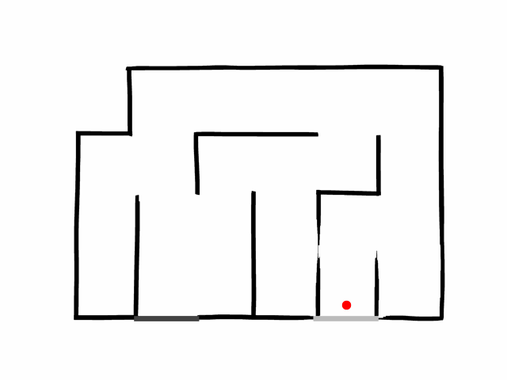
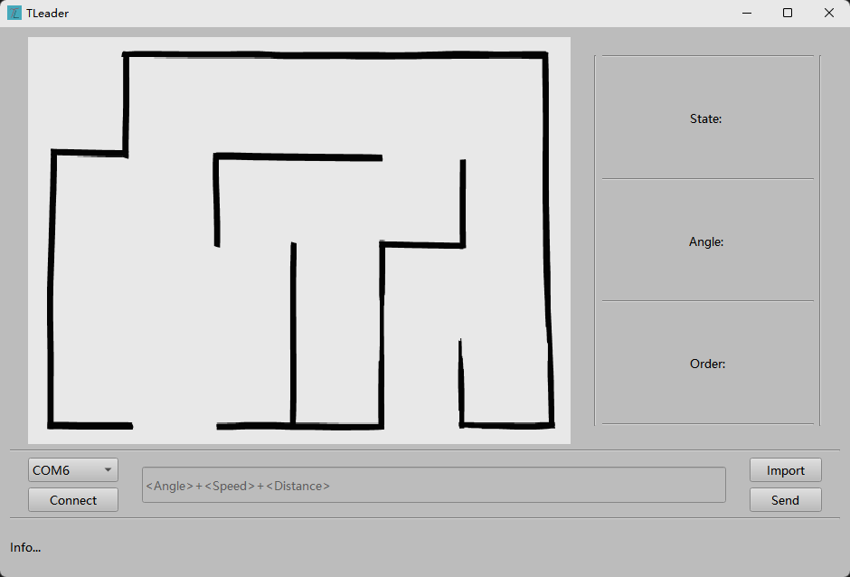
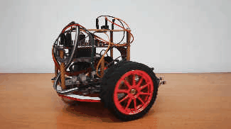

# ETDCar

"基于路径规划的智能盲人导航车"，模拟设想的全过程，实现了在上位机的控制下小车导航及避障

历时两周

### 文件结构

+ `code/`存储代码
+ `doc/`存储PPT及总结报告
+ `video/`存储视频展示

### 效果展示

+ 路径规划

+ 上位机，可直接运行[`code/TLeader/中可执行文件`](./code/TLeader/TLeader.exe)

+ 视频展示，可参考`video/`

<video src="video/完整功能.mp4"></video>

+ 车身展示

+ 避障展示

